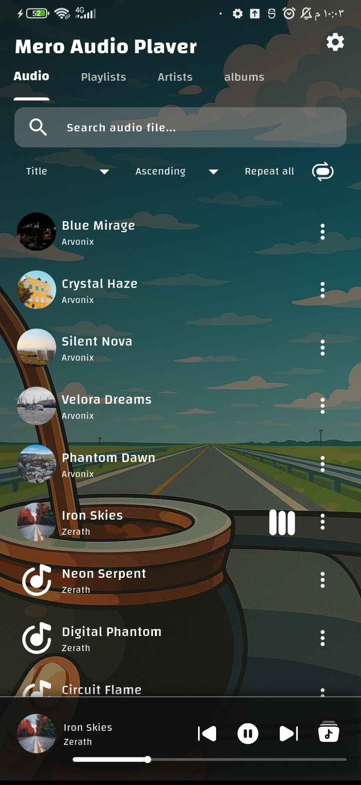
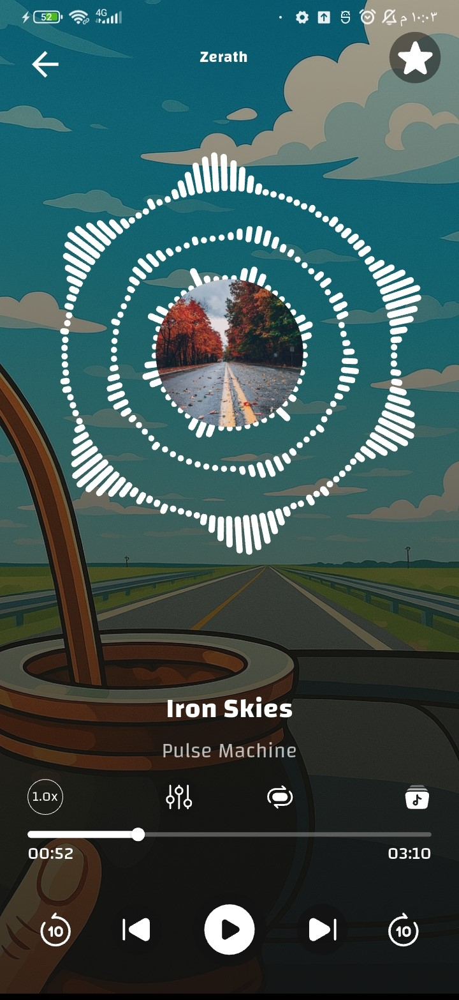
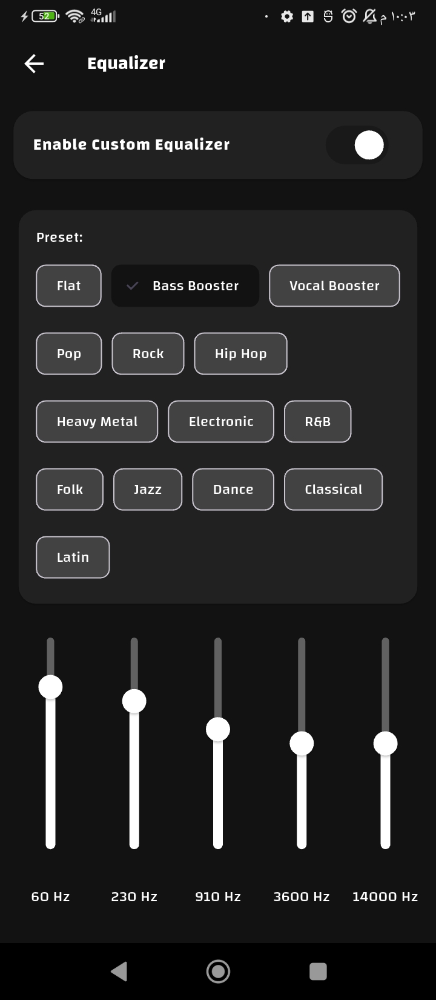
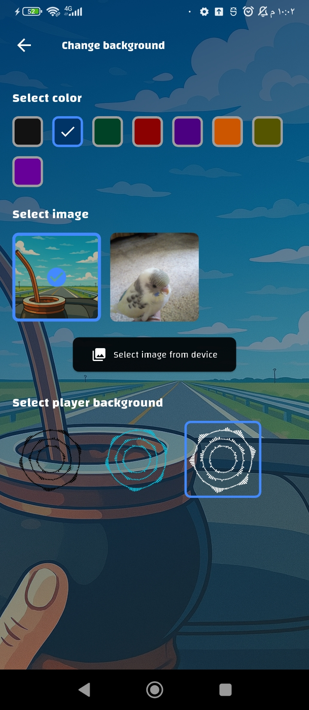
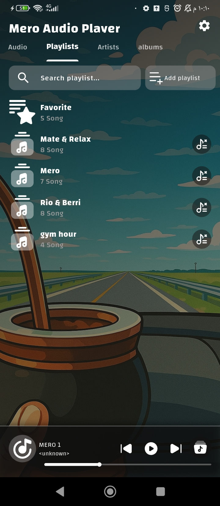
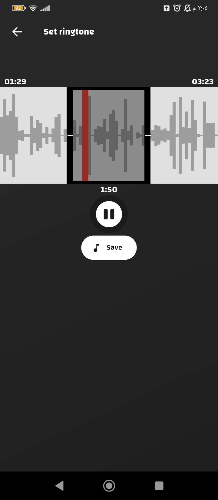

# Mero Audio Player


Your ultimate offline music companion — designed for speed, simplicity, and full control of your listening experience.

A showcase of advanced Flutter development, clean architecture, and native Android integration.

## 📸 App Preview
<p align="center">
  
  
  
</p>

<p align="center">
  
  
  
</p>

---

## 📥 Download Now

<p align="center">
<a href="https://github.com/SlemanDayoub7/mero_audio_player/releases/download/music/mero.audio.player.apk">
</a>

</p>

---

## 🚀 Features
-**Offline-First Music Library**:
Instantly play all your local audio files — no internet required.

-**Smart Organization**:
Browse your music by songs, artists, albums, or folders.

-**Advanced Playback**:
Create smart playlists and mark your favorite songs for quick access.

-**Background Playback**:
Seamless listening with full notification controls and song artwork on the lock screen.

## 🛠️ Powerful Tools
-**Built-in Equalizer**:
Fine-tune your music with a powerful multi-band equalizer.

-**Audio Trimmer & Ringtone Set**:
Cut any part of a song and set it as your phone's ringtone directly from the app.

-**Global Search & Sort**:
Find music quickly with search and sort by title, artist, album, duration, size, or date added.

## 🎨 Customization
-**Visual Appeal**:
Beautiful, adaptive themes and custom wallpapers to personalize the player's look and feel.

-**Internationalization**:
Support for 40 languages, providing a native experience for users worldwide.

## 🏗️ Technical Architecture
This project is built to demonstrate professional, scalable Flutter development practices.
### Clean Architecture & State Management
-**🔄 BLoC Pattern**:
The app uses flutter_bloc for predictable, testable, and manageable state management. All events and states are built with equatable for efficient comparison.

-**🧩 Clean Architecture**:
The codebase is structured into distinct layers (Presentation, Domain, Data) to ensure separation of concerns, testability, and maintainability.

-**💉 Dependency Injection**:
get_it is used for managing dependencies in a clean and decoupled manner.

### Persistence & Data**
-**🗄️ Local Database**:
Hive is used for fast, lightweight local storage (e.g., favorites, playlists, app settings).

-**📁 File & Path Handling**:
path_provider and media_store_plus are used for robust access to the device's file system and media library.

### Audio Engine
-**🎧 Core Playback**:
Powered by just_audio and audio_service for robust, background-capable audio playback that integrates with the system.

-**🔊 Advanced Audio Features**:

equalizer_flutter for system-level equalizer controls.

just_audio_background for configuring the Android notification.

on_audio_query to efficiently fetch metadata from the device's media store.

-**🎼 Audio Manipulation**:
Custom Method Channels are implemented to access native Android code for audio trimming and interacting with system settings.

### UI/UX
-**📐 Responsive Design**:
flutter_screenutil is used to create a consistent UI across different screen sizes and densities.

-**🎭 Rich Animations**:
lottie for smooth, beautiful animations.

-**🖼️ Vector Graphics**:
flutter_svg for crisp, scalable icons and graphics.

-**📜 Scrolling Text**:
marquee for long song titles that scroll automatically.

-**📱 Native Feel**:
cupertino_icons and Material Design are used to provide a familiar experience.

### Other Key Plugins
-**permission_handler**:
Manages runtime permissions gracefully.

-**share_plus**:
Allows sharing songs and app content.

-**ringtone_set_plus**:
Handles the system-level process of setting a ringtone.

-**easy_localization**:
Manages the 40+ language supports efficiently.

-**url_launcher**:
For opening links.


## 🔧 Installation & Setup
### Prerequisites
- Flutter SDK
- Device or emulator for testing
- Android Studio / VS Code

### Steps
#### Clone the repository
```bash
git clone https://github.com/SlemanDayoub7/mero_audio_player.git
cd mero_audio_player
```
#### Get dependencies
```bash
flutter pub get
```
#### Generate necessary files
```bash
flutter packages pub run build_runner build --delete-conflicting-outputs
```
```bash
flutter pub run easy_localization:generate -S assets/locales -O lib/generated -f keys
```
#### Run the app
```bash
flutter run
```
#### 🛠️ Building for Release
To build an APK for distribution:
```bash
flutter build apk --release --split-per-abi
```
# **🤝 Contributing**:
Contributions, issues, and feature requests are welcome! Feel free to check the issues page.

# **📄 License**:
This project is licensed under the GPL-3.0 license [LICENSE](LICENSE) file.

# **👨‍💻 Developer**:
- Sleman Dayoub
- [LinkedIn](https://www.linkedin.com/in/sleman-dayoub-6b95a6284/)

⭐ If you found this project helpful or impressive, don't forget to give it a star!
</div>


